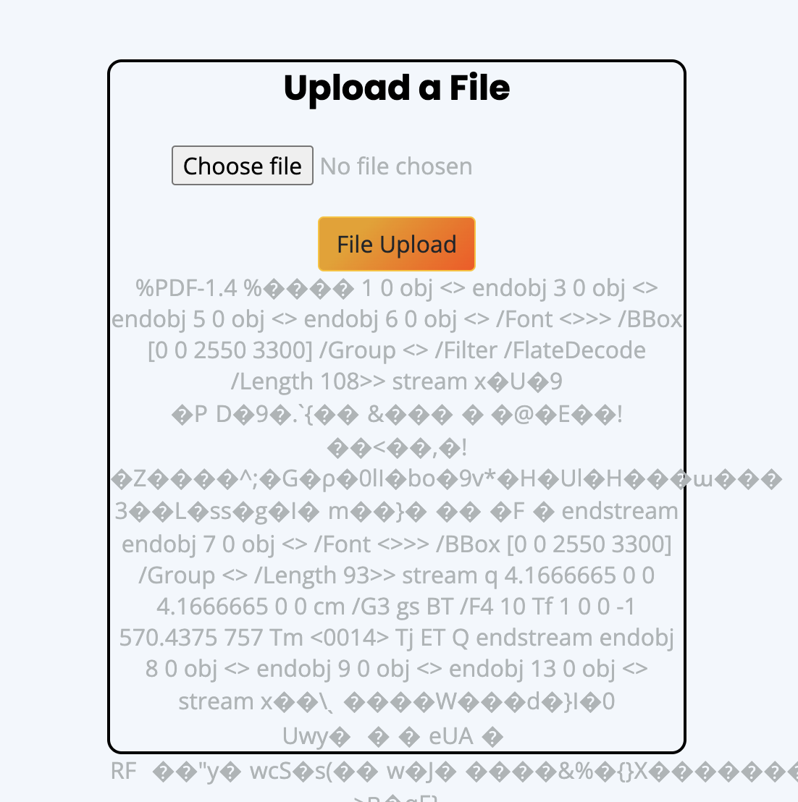

# HTML Injection: Understanding Web Vulnerabilities

## Introduction
HTML Injection presents a critical vulnerability in web applications, allowing attackers to inject malicious HTML code via specific parameters or entry points. This report aims to delve into the concept of HTML Injection, its severity, and mitigation strategies through a series of practical labs.

## What is HTML Injection?
HTML Injection arises when web applications inadequately handle user-supplied data, providing avenues for attackers to insert HTML code into the page. Unlike Cross-Site Scripting (XSS), HTML Injection restricts attackers to injecting certain HTML tags, limiting the potential scope of their malicious activities. Attackers typically exploit this vulnerability through social engineering or by deceiving users into interacting with malicious content.

## Severity
HTML Injection vulnerabilities are classified as P4 bugs with a CVSS score ranging from 0.1 to 3.9, indicating a low level of severity. However, in cases involving account takeover, the severity can escalate to P3.

## Lab Walkthrough

### Lab 1: HTML's are easy!
#### Observation:
The lab interface features a search bar that accepts user input.

#### Solution:
1. Entered a name into the search bar to verify input reflection.
2. Tested for HTML injection by inputting the payload "< h1>Cybersecurity with MKW < /h1>".
3. Confirmed vulnerability based on the displayed output.

### Lab 2: Let me Store them!
#### Observation:
The lab presents a login page and a registration form.

#### Solution:
1. Created a user with crafted payloads for the first and last names.
2. Added HTML code in the form and it stored it as text
2. Log in to observe the effects of stored HTML injection.

### Lab 3: File Names are also vulnerable!
#### Observation:
A file upload feature is provided.

#### Solution:
1. Injected an HTML tag to confirm vulnerability.

### Lab 4: File Content and HTML Injection a perfect pair!
#### Observation:
Similar to Lab 3, with file upload functionality.

#### Solution:
1. Uploaded an PDF file.
2. Demonstrated the risk of allowing file content interpretation.

### Lab 5: Injecting HTML using URL
#### Observation:
No injectable parameter is visible, but the URL is displayed.

#### Solution:
1. Modified the URL with an HTML injection payload.
2. Confirmed vulnerability based on the reflected output.

### Lab 6: Encode IT!
#### Observation:
A familiar lab interface resembling Lab 1.

#### Solution:
1. Successfully executed HTML injection with the encoded payload.

## Conclusion
HTML Injection poses a significant threat to web application security. Through practical labs, we explored various scenarios and mitigation techniques. It's crucial for developers to implement proper input validation and output encoding to effectively mitigate HTML Injection vulnerabilities.

---

**Mehrosh Khan Wardag**  
Intern, Hacktify
